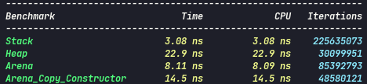

# Arena-mobi

Arena created for project mobi-av disponibilized in github to usage

# Benchmark

Benchmark using [benchmark-google](https://github.com/google/benchmark) 



for compile benchmark 
```
  mkdir build
  cd build
  cmake ..
  make

```

# Usage Arena

```C
  #include "include/arena.hpp"
  
  Arena fast(3*sizeof(int)); // allocate 3 blocks long from an length int
  
  int main( void )
  {
    // requests blocks
    int *p1 = (int*)fast.req(sizeof(int));
    *p1 = 100;

    int *p2 = (int*)fast.req(sizeof(int));
    *p2 = 400;

    int *p3 = (int*)fast.req(sizeof(int));
    *p3 = 400;
    
    return 0;
  }
```

Functions extras :

```C
void mmem(unsigned int ); // allocate more space in the arena 
```
obs: when you make a request for more space the previously created arena will be completely erased and the requested space will be allocated

```C
void dell(); // will put the pointer to the beginning of the arena
unsigned int afree(); // will bring the value of available space in the arena
```
